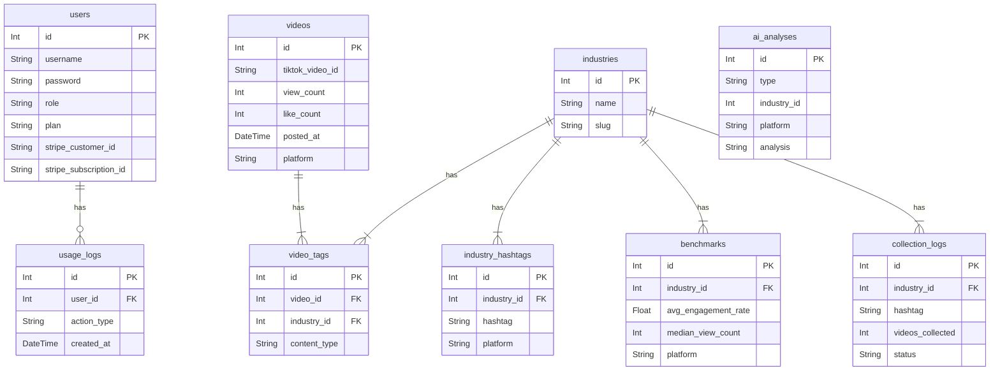

# 縦型ショート動画分析ツール 仕様書

## 1. 概要

本ドキュメントは、縦型ショート動画分析ツール「BOOSTTECH 縦型ショート動画分析」の機能、技術構成、データモデルに関する仕様を定義するものです。

### 1.1. 目的

TikTok、YouTube Shorts、Instagram Reelsといった主要な縦型ショート動画プラットフォームの投稿データを収集・分析し、ユーザーが効果的な動画コンテンツ戦略を立案・実行することを支援します。市場のトレンドを把握し、競合と比較し、自社コンテンツのパフォーマンスを最大化するためのインサイトを提供します。

### 1.2. ターゲットユーザー

- 企業のマーケティング担当者
- SNS運用代行代理店
- コンテンツクリエイター
- インフルエンサー

## 2. 機能要件

### 2.1. データ収集

- **対象プラットフォーム**: TikTok, YouTube Shorts, Instagram Reels
- **収集トリガー**: Vercel Cronによる定時実行（毎日0時 JST）、およびユーザーによる手動実行。
- **収集ロジック**: 各業種（Industry）に紐づくハッシュタグ（`industry_hashtags`）を元に、Apify ACTORを利用して動画データを収集します。収集対象期間は「実行日の前日から1ヶ月前まで」に投稿された動画です。
- **収集データ項目**: 再生数、いいね数、コメント数、シェア数、エンゲージメント率、投稿日時、動画説明、ハッシュタグ一覧、投稿者情報など。

### 2.2. ダッシュボード (`/dashboard`)

- **表示データ**: 主要KPIサマリー、収集した動画の一覧、プラットフォーム別・業種別のパフォーマンス比較グラフなどを表示します。
- **フィルタリング**: プラットフォーム（TikTok/YouTube/Instagram）、業種で表示データを絞り込めます。
- **AI分析サマリー**: OpenAI API（GPT-4.1-mini）を利用し、表示されているデータの傾向や特筆すべき点をまとめた「AI分析サマリー」を自動生成して表示します。

### 2.3. ランキング (`/ranking`)

- **ランキング指標**: 再生数、いいね数、コメント数、シェア数、エンゲージメント率など、複数の指標で動画をソートし、ランキング形式で表示します。
- **フィルタリング**: プラットフォーム、業種、投稿期間などで絞り込みが可能です。

### 2.4. 動画詳細 (`/videos/[id]`)

- **詳細データ**: 個別の動画に関するすべての収集データを表示します。
- **ベンチマーク比較**: 同一業種の平均値（再生数中央値、エンゲージメント率平均など）と比較し、動画のパフォーマンスを評価します。
- **AI自動タギング**: OpenAI APIを利用して、動画の内容を分析し、「コンテンツタイプ」「フックタイプ」「演者タイプ」などの分析用タグを自動で付与します。

### 2.5. データエクスポート

- **対応形式**: ダッシュボードやランキングの表示データをCSV、PDF、PPTX形式でエクスポートできます。
- **利用制限**: プランごとに月間のエクスポート回数に上限が設けられています。

### 2.6. ユーザー管理と認証

- **認証**: メールアドレスとパスワードによる独自の認証システムを実装。パスワードはbcryptでハッシュ化して保存します。
- **ロールベースアクセス制御 (RBAC)**:
    - **マスター管理者 (`master_admin`)**: 全ての機能にアクセス可能。ユーザー管理、システム設定、売上確認など。
    - **管理者 (`admin`)**: 自身が作成したユーザーの管理、およびコンテンツ管理機能にアクセス可能。
    - **一般ユーザー (`viewer`)**: データ閲覧・分析機能のみ利用可能。
- **ユーザー管理画面 (`/users`)**: 管理者以上の権限を持つユーザーが、ユーザーの招待、ロール・プランの変更、アカウントの有効/無効化を行えます。

### 2.7. プラン・課金

- **決済**: Stripeと連携し、クレジットカードによる月額サブスクリプション決済を実現します。
- **プラン体系**:

| プラン名 | 月額料金（税別） | データ更新頻度 | 分析回数/月 | エクスポート回数/月 |
|---|---|---|---|---|
| **Free** | ¥0 (7日間) | 週1回 | 3回 | 3回 |
| **Starter** | ¥9,800 | 週3回 | 60回 | 60回 |
| **Premium** | ¥19,800 | 毎日1回 | 200回 | 200回 |
| **Max** | ¥49,800 | 毎日3回 | 500回 | 500回 |

- **プラン管理画面 (`/settings`)**: ユーザーは自身の契約プランの確認、上位プランへのアップグレード、サブスクリプションの解約を行えます。マスター管理者は同ページで全ユーザーのプラン別統計（ユーザー数、MRR）を確認できます。
- **Webhook**: StripeからのWebhook（`checkout.session.completed`, `customer.subscription.updated`など）を受信し、ユーザーのプラン状況を自動でデータベースに反映します。

### 2.8. 管理者機能 (`/admin`)

- **対象ロール**: `master_admin`, `admin`
- **機能**: 全動画を対象としたAIによる一括タギングの実行、業種別ベンチマークデータの手動再計算など、システム全体のデータメンテナンス機能を提供します。

## 3. 非機能要件

### 3.1. パフォーマンス

- **画像最適化**: `next/image`を利用し、画像をWebP形式に変換・最適化して配信します。
- **フォント最適化**: `next/font`を利用し、Google Fontsをセルフホストすることで、レンダーブロッキングを回避します。
- **動画の遅延読み込み**: LPのデモ動画などは`preload="none"`と`loading="lazy"`を指定し、初期表示速度への影響を最小限に抑えます。
- **コード分割**: `next/dynamic`を利用し、`recharts`などの重いライブラリを動的にインポートすることで、初期バンドルサイズを削減します。

### 3.2. セキュリティ

- **セッション管理**: `iron-session`を利用し、暗号化されたCookieでセッションを管理します。
- **API保護**: 全てのAPIエンドポイントでセッション情報を検証し、不正なアクセスを防ぎます。
- **環境変数**: APIキーやデータベース接続情報などの機密情報は、Vercelの環境変数で安全に管理します。
- **Stripe Webhook**: Webhookリクエストの署名を検証し、Stripeからの正当なリクエストであることを確認します。

### 3.3. UI/UX

- **デザイン**: 緑色を基調としたクリーンで直感的なUIを提供します。
- **レスポンシブ**: PC、タブレット、スマートフォンなど、あらゆるデバイスで快適に利用できるよう、レスポンシブデザインに対応しています。

## 4. 技術スタック

| カテゴリ | 技術 | 目的 |
|---|---|---|
| **フレームワーク** | Next.js (App Router) | フルスタック開発（フロントエンド、バックエンドAPI） |
| **言語** | TypeScript | 型安全性と開発効率の向上 |
| **UIライブラリ** | React | コンポーネントベースのUI構築 |
| **スタイリング** | Tailwind CSS | ユーティリティファーストのCSSフレームワーク |
| **UIコンポーネント** | shadcn/ui, Radix UI | アクセシビリティの高いUIコンポーネント基盤 |
| **データベース** | PostgreSQL | リレーショナルデータストア |
| **ORM** | Prisma | 型安全なデータベースアクセス |
| **認証** | iron-session, bcrypt | セッション管理、パスワードハッシュ化 |
| **決済** | Stripe | サブスクリプション決済 |
| **AI** | OpenAI API (GPT-4.1-mini) | AI分析サマリー、自動タギング |
| **データ収集** | Apify | 外部サイトからのデータクローリング |
| **ホスティング** | Vercel | デプロイ、サーバーレス関数、Cronジョブ |

## 5. データモデル (ER図)

主要なデータベースのテーブル構成とリレーションは以下の通りです。

